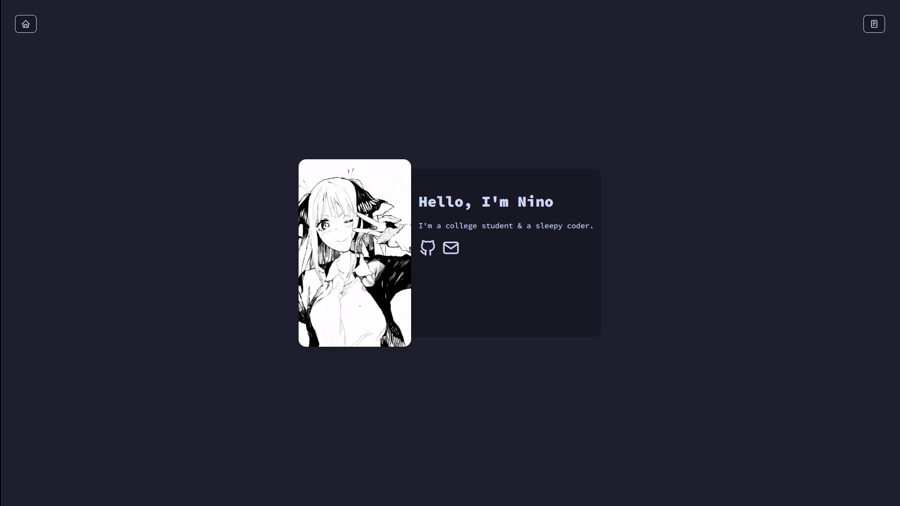
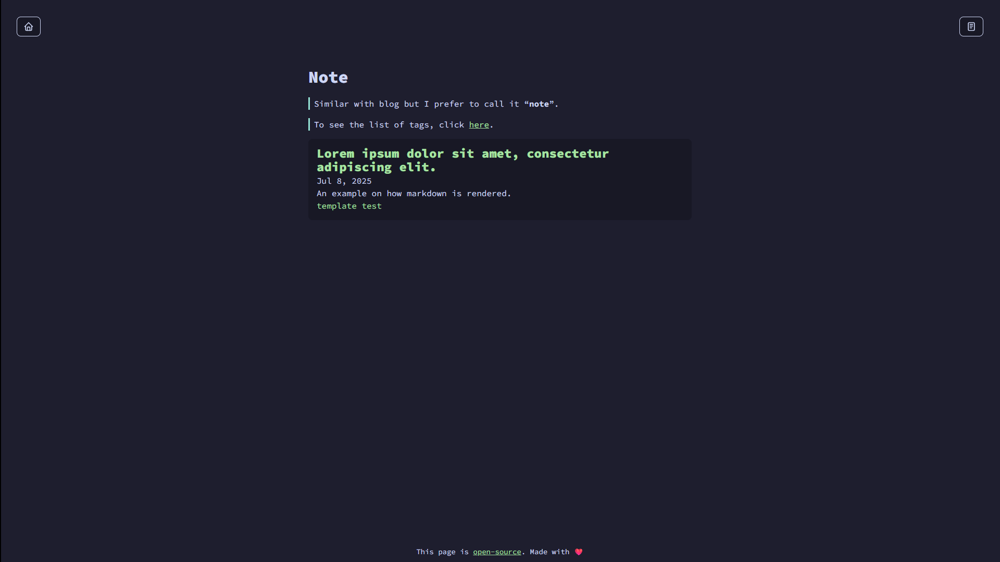

# takai24.github.io

> [!IMPORTANT]
> This project is licensed under the [GNU General Public License v3.0](./LICENSE).

## 📸 Preview

### 1. Index

### 2. 404

### 3. Note

## 🔔 Notice
+ This theme is called **July**, based on the time of year I made it.
+ Based on what OS you are using, the emoji may be rendered differently.
+ Other themes are stored in the `themes` folder.

## 🖼️ Assets
| Name | Source |
|------|--------|
| SVGs | [tabler.io/icons](https://tabler.io/icons/) |
| Font | [Source Code Pro](https://fonts.google.com/specimen/Source+Code+Pro) |
| Favicon | [かわち](https://www.pixiv.net/en/users/1326778) (pixiv). |
| Nino Nakano | ⚠️ Original Source Not Found. |

## 🛠️ Infrastructure
+ This page is [open-source](./LICENSE).
+ Domain registered at: [is-a.dev](https://is-a.dev).
+ Static site generator: [Hugo](https://gohugo.io).
+ Theme: [July](https://github.com/takai24/takai24.github.io/tree/main/themes/july).
+ Color scheme: [Catppuccin Mocha - base16](https://github.com/catppuccin/catppuccin).

> Made by ***takai24*** with ❤️.