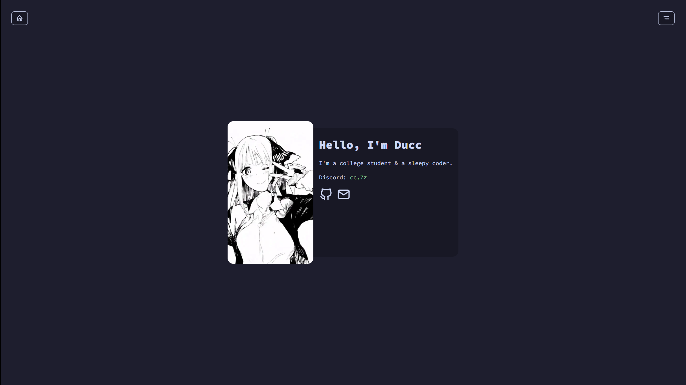
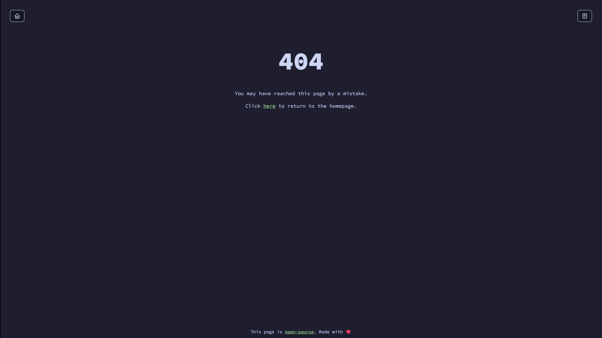

# takai24.github.io

My personal website  :D

## Preview
<h3>

    
 Index 

    

    
 404 Not Found 

    

</h3>

## Assets
| Name | Source |
|------|--------|
| SVGs | [tabler.io/icons](https://tabler.io/icons/) |
| Font | [Source Code Pro](https://fonts.google.com/specimen/Source+Code+Pro) |
| Animated Card | The girl is known as Nino Nakano but I couldn't find the original source. |

## Notice
+ Best experience on wide screen devices.
+ Based on what OS you are using, the emoji may be rendered differently.
+ Themes are stored at the [`themes`](./themes) folder.

## Build
+ Domain registered at [is-a.dev](https://is-a.dev)
+ Static site generator: [Hugo](https://gohugo.io)
+ Theme: [July](https://github.com/takai24/takai24.github.io/tree/main/themes/july)

> [!IMPORTANT]
> This project is licensed under the [GNU General Public License v3.0](./LICENSE).